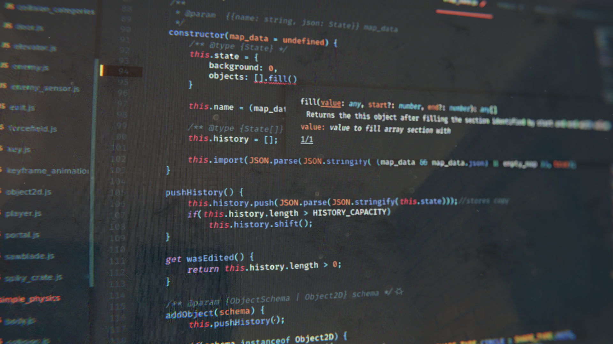

# Blender-portfolio
Most of my 3D renders created using Blender and Gimp. 
Most of used textures are or were free and comes from this site: <a href='https://www.poliigon.com/search?type=texture'>poliigon</a>

